# Motion Canvas in Rust

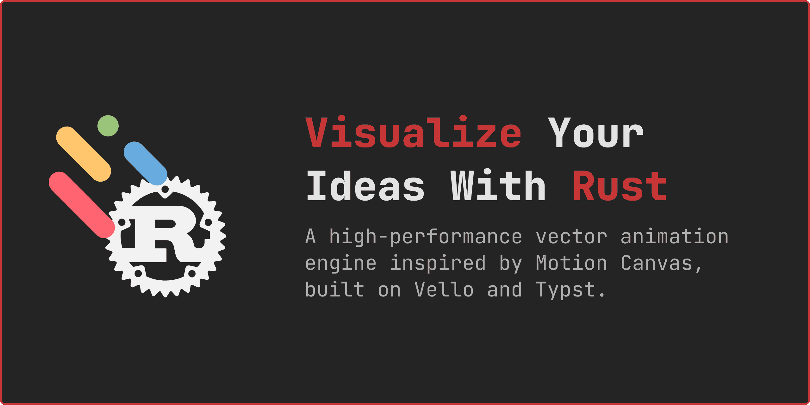

A high-performance vector animation engine inspired by Motion Canvas, built on Vello and Typst.

> [!IMPORTANT]
> **Prototype Status**: This project is a functional prototype and proof-of-concept. It is **not** a 1:1 implementation of the original Motion Canvas API or features.

## Links

- [https://docs.rs/motion-canvas-rs](https://docs.rs/motion-canvas-rs)
- [https://crates.io/crates/motion-canvas-rs](https://crates.io/crates/motion-canvas-rs)

## Installation

Add the library to your `Cargo.toml`. To enable all features (math, code blocks, images, export), use the `full` flag:

```bash
# Enable everything
cargo add motion-canvas-rs --features full

# Or pick only what you need (e.g., just math, images, and audio)
cargo add motion-canvas-rs --features math,image,audio
```

## Features

| Feature | Description | Enables |
|:---|:---|:---|
| `math` | Typst-powered LaTeX math rendering. | `MathNode` |
| `code` | Syntax-highlighted code blocks via Syntect. | `CodeNode` |
| `image` | Bitmap (PNG, JPEG) and Vector (SVG) support. | `ImageNode` |
| `audio` | Independent audio timeline and MP3 playback. | `play!`, `AudioNode` |
| `export` | Headless frame rendering and video generation. | `project.export()` |
| `full` | Meta-feature that enables all of the above. | Everything |

### Key Capabilities
- **High-performance**: GPU-accelerated vector rendering via Vello.
- **Arc-length Sampling**: Accurate path animations and offsets.
- **Easing Library**: 30+ standardized easing functions.
- **FFmpeg Integration**: Direct streaming of animation frames or merging with audio.
- **Audio Support**: Synchronized MP3 playback and independent audio timelines.
- **Clean API**: Streamlined prelude for high-speed prototyping.
- **Node Primitives**: Built-in support for Circles, Rects, Polygons, Lines, and Groups.

## Supported Nodes

| Node | Description | Transform Properties |
|:---|:---|:---|
| `AudioNode` | Independent audio clip playback. | `volume`, `crop` |
| `CameraNode` | Viewport transformation (pan, zoom, rotate). | `position`, `rotation`, `zoom`, `centered` |
| `Circle` | Basic circle primitive. | `position`, `rotation`, `scale`, `radius`, `anchor` |
| `CodeNode` | Syntax-highlighted code with transitions. | `position`, `rotation`, `scale`, `code`, `anchor` |
| `GroupNode` | Hierarchical grouping of any nodes. | `position`, `rotation`, `scale`, `children`, `anchor` |
| `ImageNode` | Bitmap and SVG image display. | `position`, `rotation`, `scale`, `size`, `anchor` |
| `Line` | Simple line between two points. | `position`, `rotation`, `scale`, `start`, `end`, `anchor` |
| `MathNode` | Typst-powered mathematical formulas. | `position`, `rotation`, `scale`, `equation`, `anchor` |
| `PathNode` | Complex path sampling and animation. | `position`, `rotation`, `scale`, `arc-length`, `anchor` |
| `Polygon` | Regular and custom polygon shapes. | `position`, `rotation`, `scale`, `points`, `anchor` |
| `Rect` | Rectangle with optional corner radius. | `position`, `rotation`, `scale`, `size`, `radius`, `anchor` |
| `TextNode` | High-quality text rendering (skrifa). | `position`, `rotation`, `scale`, `text`, `anchor` |

## Project Structure

The engine is organized into a modular structure:

- `src/lib.rs`: Library entry point with clean module re-exports.
- `src/engine/nodes/`: Individual node implementations.
- `src/engine/animation/`: Core animation traits and flow controls.
- `src/engine/easings.rs`: Comprehensive easing function library.
- `examples/`: Ready-to-run demonstration scripts.

## Quick Start

```rust
use motion_canvas_rs::prelude::*;
use std::time::Duration;

fn main() {
    // Project::default() uses default values (800x600, 60fps)
    let mut project = Project::default()
        .with_title("Quick Start")
        .with_background(Color::rgb8(0x1a, 0x1a, 0x1a))
        .close_on_finish();

    // Nodes support a builder pattern and Default traits
    let circle = Circle::default()
        .with_position(Vec2::new(400.0, 300.0))
        .with_radius(100.0)
        .with_fill(Color::RED);

    let text = TextNode::default()
        .with_position(Vec2::new(400.0, 150.0))
        .with_text("Hello Motion Canvas!")
        .with_font_size(48.0)
        .with_fill(Color::WHITE);

    project.scene.add(Box::new(circle.clone()));
    project.scene.add(Box::new(text.clone()));

    project.scene.video_timeline.add(all![
        circle.radius.to(100.0, Duration::from_secs(1)),
        text.position.to(Vec2::new(400.0, 400.0), Duration::from_secs(1)),
    ]);

    project.show().expect("Failed to render");
}
```

## Running Examples

The project includes 21 examples that can be found in the [examples directory](./examples).

<details>
<summary><b>Advanced Flow</b> - Complex staggered and sequential animations.</summary>

```sh
cargo run --example advanced_flow --features=full
```

| Preview |
| - |
| 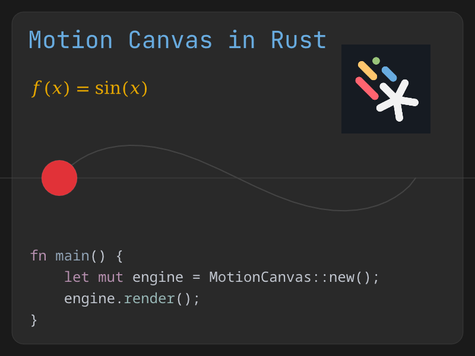 |
| [Advanced Flow Video](./assets/examples/advanced_flow.mp4) |

</details>

<details>
<summary><b>Anchors</b> - Reactive transformation origins for precise positioning.</summary>

```sh
cargo run --example anchors
```

| Preview |
| - |
| 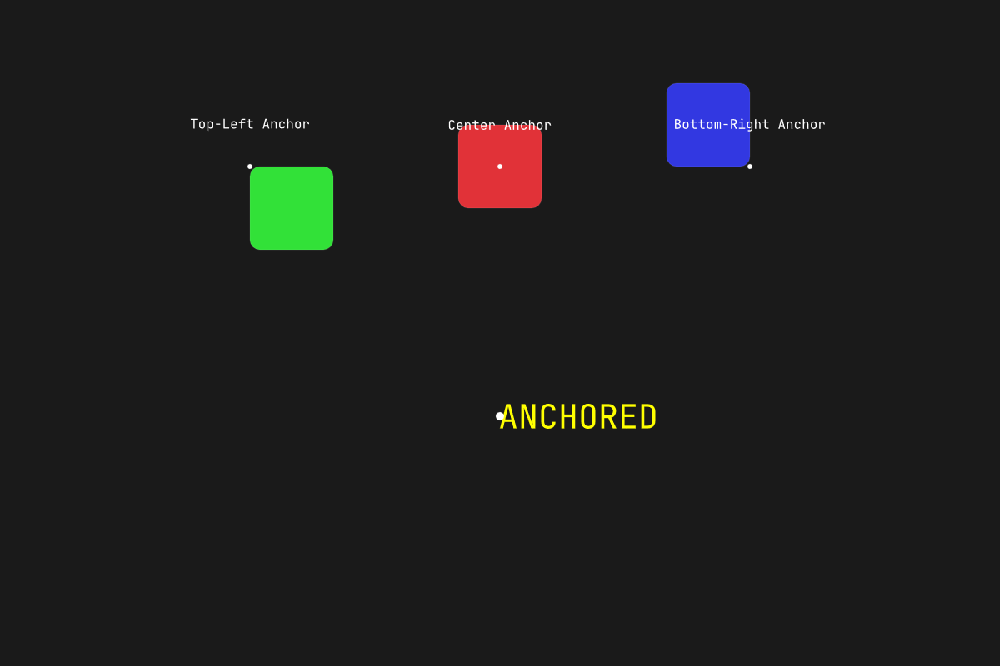 |
| [Anchors Video](./assets/examples/anchors.mp4) |

</details>

<details>
<summary><b>Audio Demo</b> - Independent audio and video timelines with cropping.</summary>

```sh
cargo run --example audio_demo --features audio
```

| Preview |
| - |
| 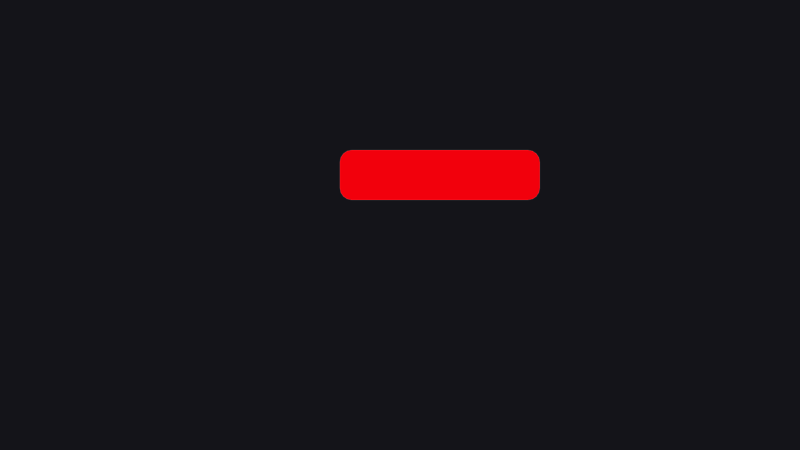 |
| [Audio Demo Video](./assets/examples/audio_demo.mp4) |

</details>

<details>
<summary><b>Camera Control</b> - Viewport-level panning, zooming, and rotation.</summary>

```sh
cargo run --example camera_demo
```

| Preview |
| - |
| 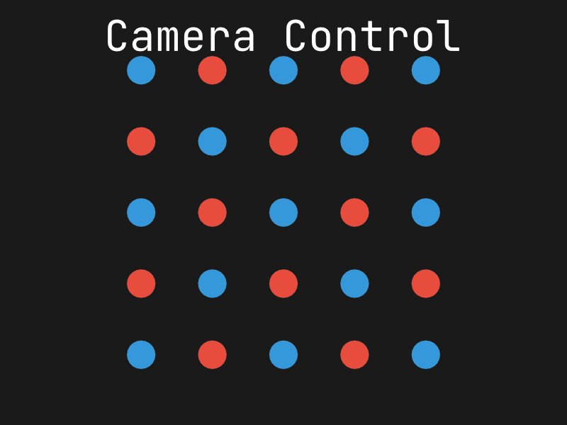 |
| [Camera Demo Video](./assets/examples/camera_demo.mp4) |

</details>

<details>
<summary><b>Code Advanced</b> - Fine-grained selection and content manipulation.</summary>

```sh
cargo run --example code_advanced --features code
```

| Preview |
| - |
| 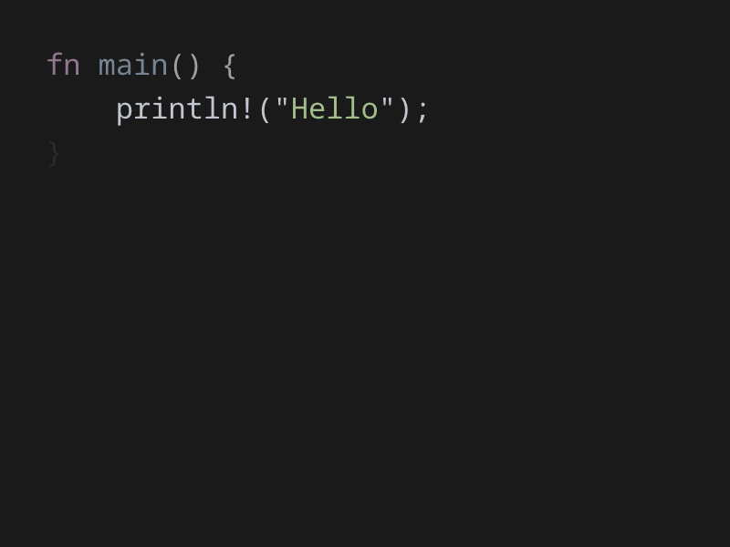 |
| [Code Advanced Video](./assets/examples/code_advanced.mp4) |

</details>

<details>
<summary><b>Code Animation</b> - "Magic Move" token-based code transitions.</summary>

```sh
cargo run --example code_animation --features code
```

| Preview |
| - |
| 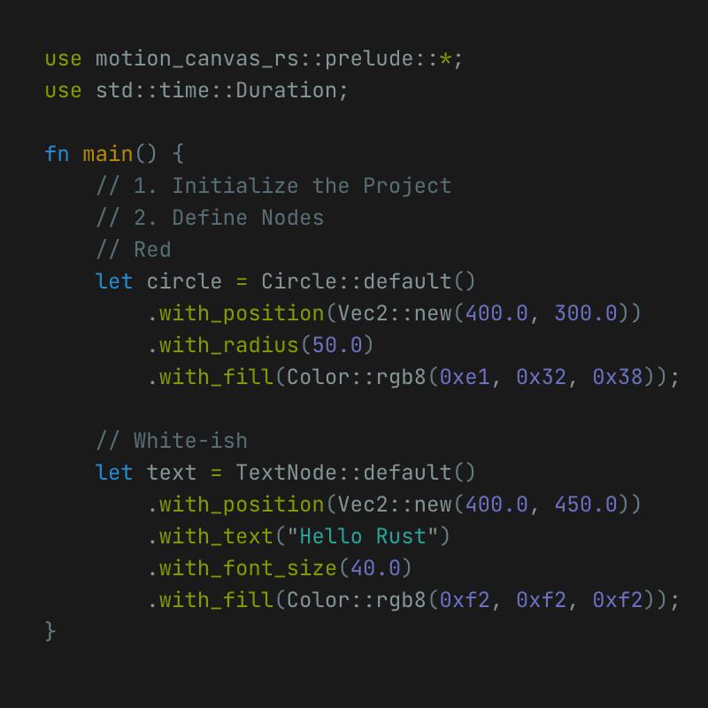 |
| [Code Animation Video](./assets/examples/code_animation.mp4) |

</details>

<details>
<summary><b>Color Interpolation</b> - Smooth transitions between color spaces.</summary>

```sh
cargo run --example color_interpolation
```

| Preview |
| - |
| 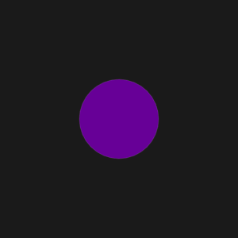 |
| [Color Interpolation Video](./assets/examples/color_interpolation.mp4) |

</details>

<details>
<summary><b>Easing Scope</b> - 100% parity easing library visualizer.</summary>

```sh
cargo run --example easing_scope
```

| Preview |
| - |
| 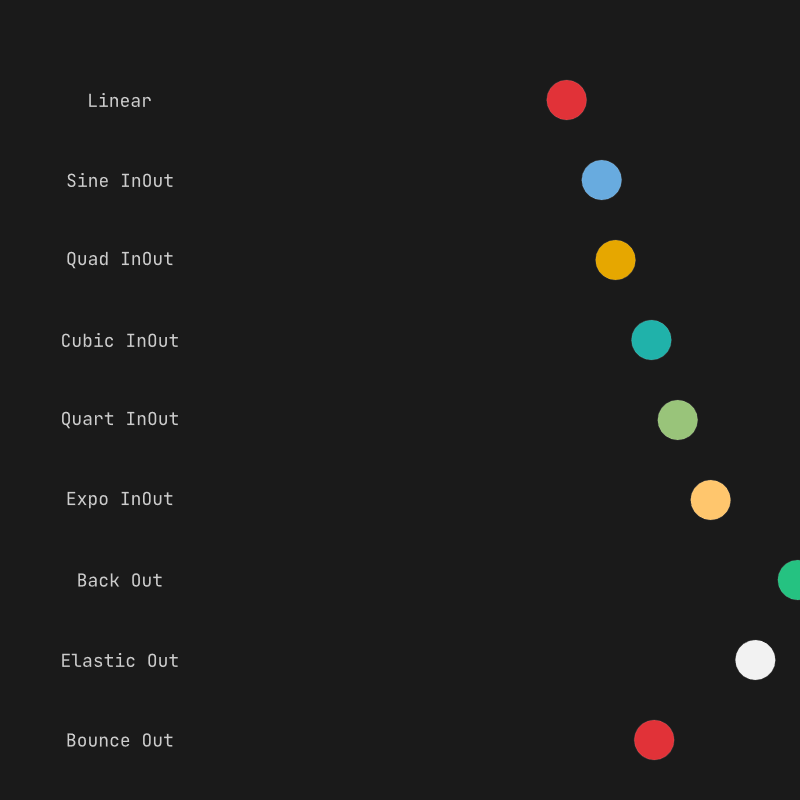 |
| [Easing Scope Video](./assets/examples/easing_scope.mp4) |

</details>

<details>
<summary><b>Explainer</b> - Showcasing the library and some of its features.</summary>

```sh
cargo run --example explainer --release --features full
```

| Preview |
| - |
| 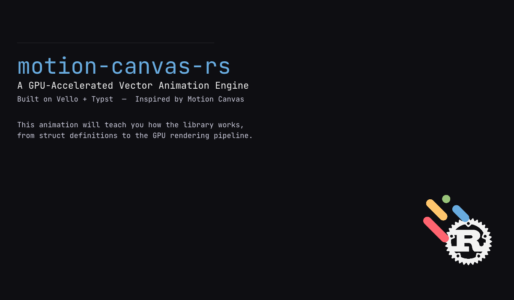 |
| [Explainer Video](https://www.youtube.com/watch?v=v4W1Y_TrWew) |

</details>

<details>
<summary><b>Export</b> - Video export with color and font-size animations.</summary>

```sh
cargo run --example export --features export
```

| Preview |
| - |
| 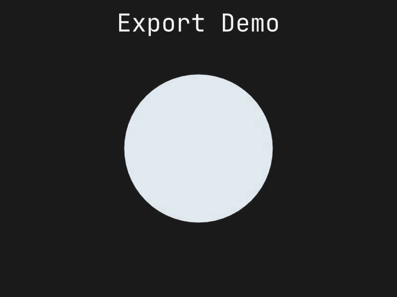 |
| [Export Video](./assets/examples/export.mp4) |

</details>

<details>
<summary><b>Getting Started</b> - Basic node creation and animation.</summary>

```sh
cargo run --example getting_started
```

| Preview |
| - |
| 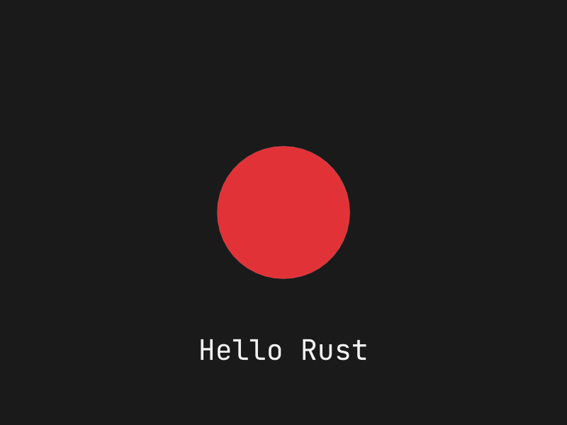 |
| [Getting Started Video](./assets/examples/getting_started.mp4) |

</details>

<details>
<summary><b>Grid</b> - Procedural grid</summary>

```sh
cargo run --example grid
```

| Preview |
| - |
| 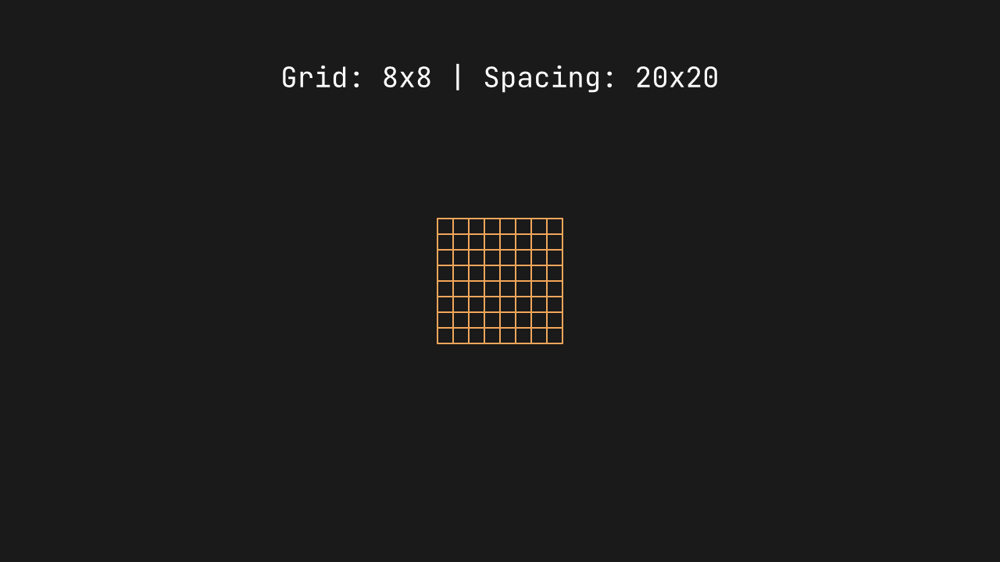 |
| [Grid Video](./assets/examples/grid.mp4) |

</details>

<details>
<summary><b>Group Animation</b> - Hierarchical transformations and inherited opacity.</summary>

```sh
cargo run --example group_animation
```

| Preview |
| - |
| 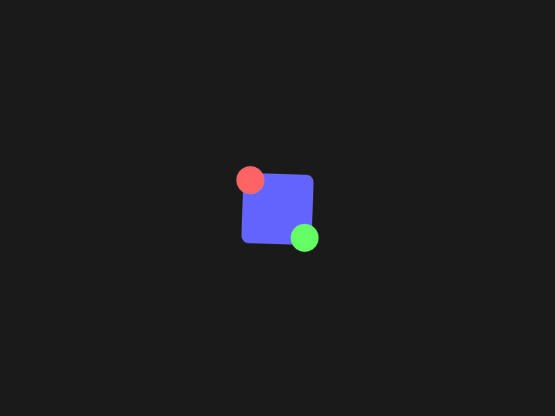 |
| [Group Animation Video](./assets/examples/group_animation.mp4) |

</details>

<details>
<summary><b>Images</b> - Bitmap image support and transformations.</summary>

```sh
cargo run --example images --features image,svg
```

| Preview |
| - |
| 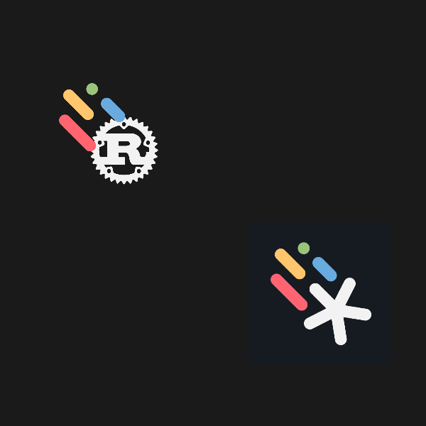 |
| [Images Video](./assets/examples/images.mp4) |

</details>

<details>
<summary><b>Math Animation</b> - Advanced mathematical transitions.</summary>

```sh
cargo run --example math_animation --features math
```

| Preview |
| - |
| 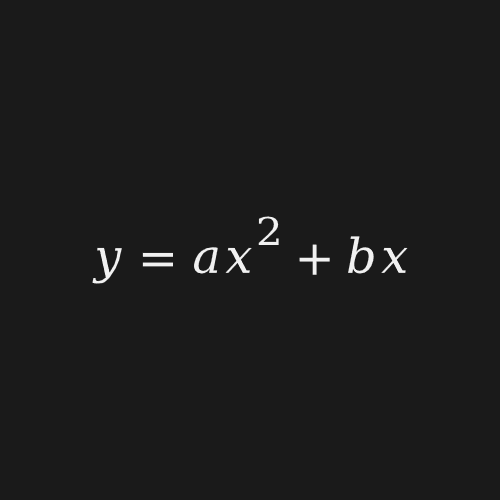 |
| [Math Animation Video](./assets/examples/math_animation.mp4) |

</details>

<details>
<summary><b>Math & Code</b> - Typst LaTeX and Syntax Highlighting.</summary>

```sh
cargo run --example math_code --features math,code
```

| Preview |
| - |
| 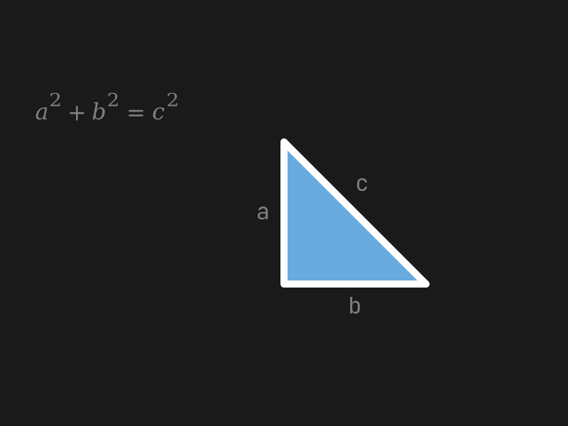 |
| [Math Code Video](./assets/examples/math_code.mp4) |

</details>

<details>
<summary><b>Nested Cameras</b> - Hierarchical viewport control and coordinate shifting.</summary>

```sh
cargo run --example nested_cameras
```

| Preview |
| - |
| 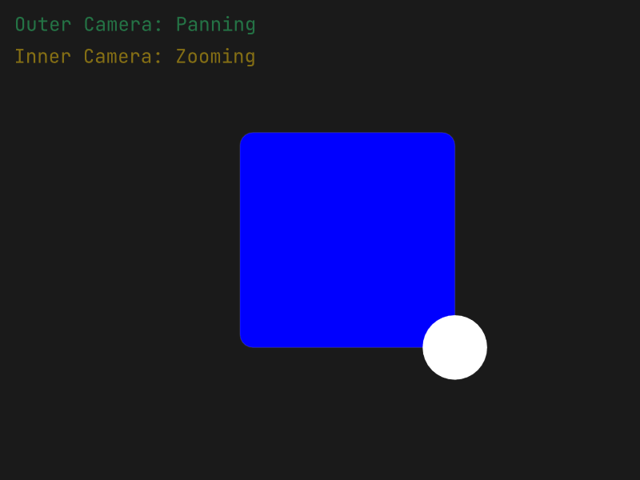 |
| [Nested Cameras Video](./assets/examples/nested_cameras.mp4) |

</details>

<details>
<summary><b>News Feed</b> - A simple architectural visualization of a news feed system.</summary>

> Based on the "News Feed System" architecture from **"System Design Interview: An Insider's Guide" (Second Edition)** by **Alex Xu**.

```sh
cargo run --example news_feed
```

| Preview |
| - |
| 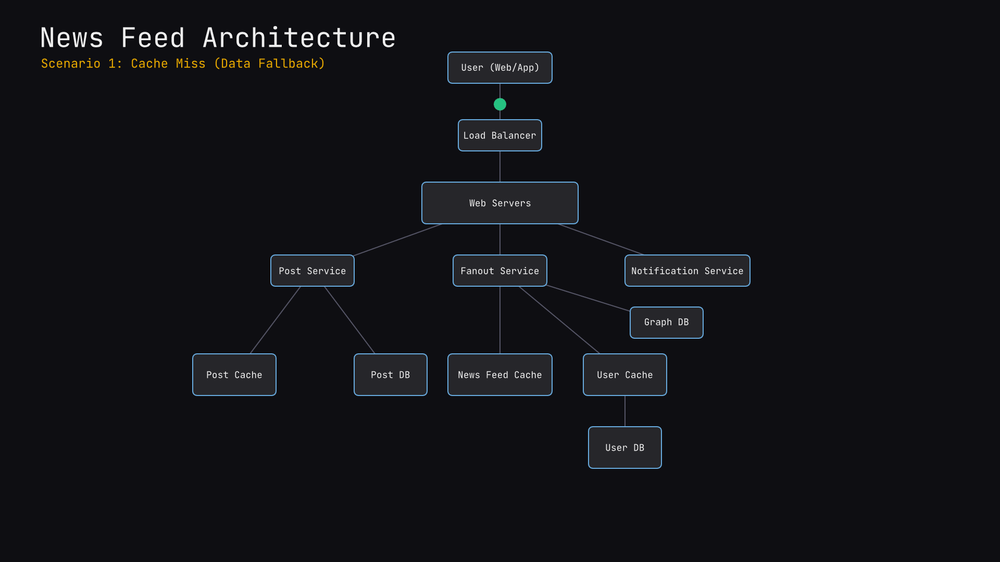 |
| [News Feed Video](./assets/examples/news_feed.mp4) |

</details>

<details>
<summary><b>Polygon</b> - Regular and custom polygon primitives.</summary>

```sh
cargo run --example polygon
```

| Preview |
| - |
| 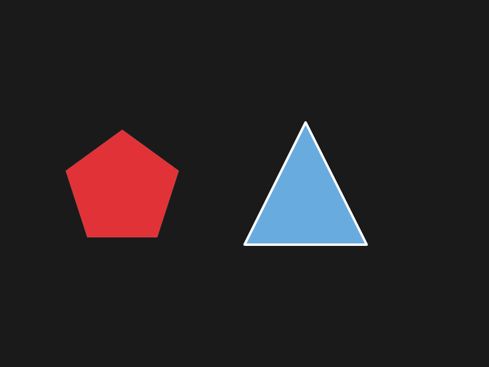 |
| [Polygon Video](./assets/examples/polygon.mp4) |

</details>

<details>
<summary><b>Shapes</b> - Circle, Rect, and Line primitives.</summary>

```sh
cargo run --example shapes
```

| Preview |
| - |
| 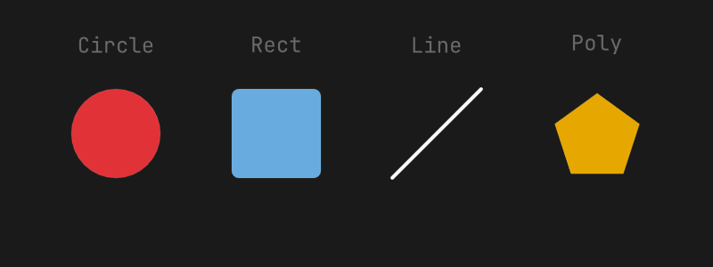 |

</details>

<details>
<summary><b>Signals</b> - Reactive signal linking and independent property animation.</summary>

```sh
cargo run --example signals
```

| Preview |
| - |
| 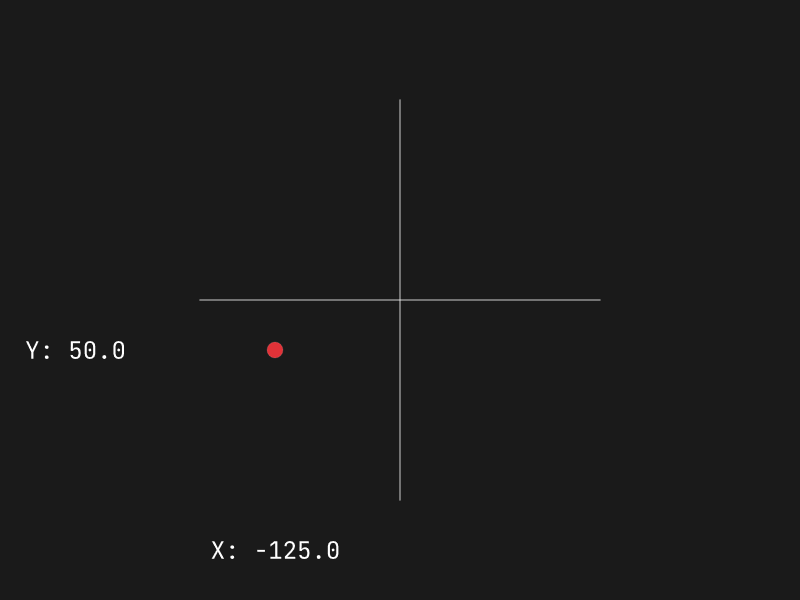 |
| [Signals Video](./assets/examples/signals.mp4) |

</details>

## Requirements

- Rust 1.75+
- FFmpeg (optional, for direct video streaming)
- System fonts (Inter, Fira Code, etc. for specific examples)

## Credits

This project is heavily inspired by the original [Motion Canvas](https://github.com/motion-canvas/motion-canvas) by [aarthificial](https://github.com/aarthificial).

Special thanks to:
- [easings.net](https://easings.net/) for the standardized easing function library.
- [shiki-magic-move](https://github.com/shikijs/shiki-magic-move) for the inspiration behind the token-based code transition logic.
- **Alex Xu** for the excellent system design diagrams in *"System Design Interview: An Insider's Guide"*, represented in the `news_feed` example.
