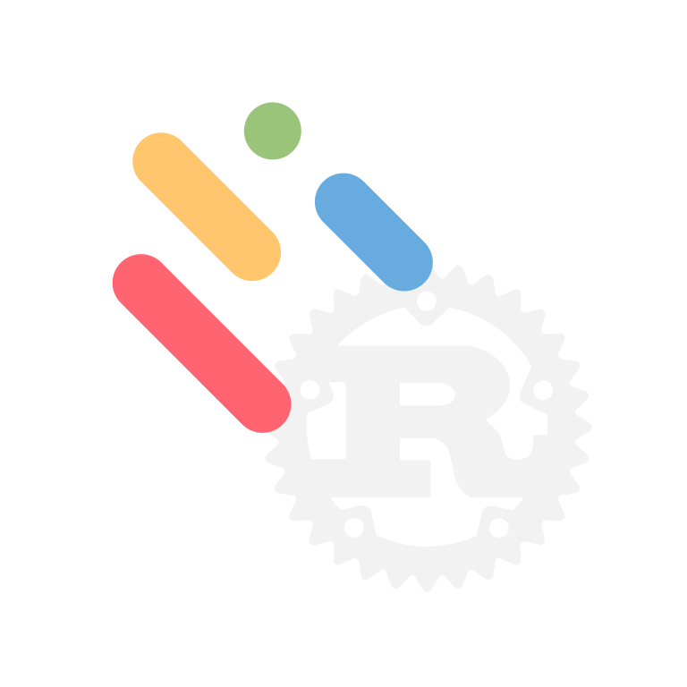

# Motion Canvas in Rust



A high-performance vector animation engine inspired by Motion Canvas, built on Vello and Typst.

> [!IMPORTANT]
> **Prototype Status**: This project is a functional prototype and proof-of-concept. It is **not** a 1:1 implementation of the original Motion Canvas API or features.

## Installation

Add the library to your `Cargo.toml`. To enable all features (math, code blocks, images, export), use the `full` flag:

```bash
# Enable everything
cargo add motion-canvas-rs --features full

# Or pick only what you need (e.g., just math and images)
cargo add motion-canvas-rs --features math,image
```

## Features

| Feature | Description | Enables |
|:---|:---|:---|
| `math` | Typst-powered LaTeX math rendering. | `MathNode` |
| `code` | Syntax-highlighted code blocks via Syntect. | `CodeNode` |
| `image` | Bitmap image support (PNG, JPEG, etc.). | `ImageNode` |
| `svg` | Vector graphics support using `resvg`. | `SvgNode` |
| `export` | Headless frame rendering and video generation. | `project.export()` |
| `full` | Meta-feature that enables all of the above. | Everything |

### Key Capabilities
- **High-performance**: GPU-accelerated vector rendering via Vello.
- **Arc-length Sampling**: Accurate path animations and offsets.
- **Easing Library**: 30+ standardized easing functions.
- **FFmpeg Integration**: Direct streaming of animation frames to video.
- **Clean API**: Streamlined prelude for high-speed prototyping.

## Project Structure

The engine is organized into a modular structure:

- `src/lib.rs`: Library entry point with clean module re-exports.
- `src/engine/nodes/`: Individual node implementations.
- `src/engine/animation/`: Core animation traits and flow controls.
- `src/engine/easings.rs`: Comprehensive easing function library.
- `examples/`: Ready-to-run demonstration scripts.

## Quick Start

```rust
use motion_canvas_rs::prelude::*;
use std::time::Duration;

fn main() {
    let mut project = Project::new(800, 600);

    let circle = Circle::new(Vec2::new(400.0, 300.0), 50.0, Color::RED);
    let text = TextNode::new(Vec2::new(400.0, 450.0), "Hello Rust", 40.0, Color::WHITE);

    project.scene.add(Box::new(circle.clone()));
    project.scene.add(Box::new(text.clone()));

    project.scene.timeline.add(all![
        circle.radius.to(100.0, Duration::from_secs(1)),
        text.position.to(Vec2::new(400.0, 500.0), Duration::from_secs(1)),
    ]);

    project.show().expect("Failed to render");
}
```

## Running Examples

The project includes several formal examples covering different features. You can run them using `cargo run --example <name>`.

<details>
<summary><b>Getting Started</b> - Basic node creation and animation.</summary>

```bash
cargo run --example getting_started
```
https://github.com/user-attachments/assets/7590c3da-8917-4ac4-8832-425211fab67b

</details>

<details>
<summary><b>Shapes</b> - Circle, Rect, and Line primitives.</summary>

```bash
cargo run --example shapes
```

</details>

<details>
<summary><b>Math & Code</b> - Typst LaTeX and Syntax Highlighting.</summary>

```bash
cargo run --example math_code
```
https://github.com/user-attachments/assets/97050ee4-0a67-4c4c-ba5d-737d7d0c101d
</details>

<details>
<summary><b>Images</b> - Bitmap image support and transformations.</summary>

```bash
cargo run --example images
```
https://github.com/user-attachments/assets/25248e66-ccc7-4422-9f2f-7b9ef361d8d9
</details>

<details>
<summary><b>Advanced Flow</b> - Complex staggered and sequential animations.</summary>

```bash
cargo run --example advanced_flow
```
https://github.com/user-attachments/assets/d283b03a-ae50-4011-9fab-77ced70a2632
</details>

<details>
<summary><b>Easing Scope</b> - 100% parity easing library visualizer.</summary>

```bash
cargo run --example easing_scope
```
https://github.com/user-attachments/assets/097e5b01-cdf4-4c9d-90a5-4cc4fc12e3ea
</details>

<details>
<summary><b>Math Animation</b> - Advanced mathematical transitions.</summary>

```bash
cargo run --example math_animation
```
https://github.com/user-attachments/assets/f3d8e774-31f4-4e96-b7b7-9e6bda0ec16f
</details>

<details>
<summary><b>Color Interpolation</b> - Smooth transitions between color spaces.</summary>

```bash
cargo run --example color_interpolation
```
https://github.com/user-attachments/assets/cd002797-84ec-4bcb-af1f-0ab6e7c20433
</details>

<details>
<summary><b>Code Animation</b> - "Magic Move" token-based code transitions.</summary>

```bash
cargo run --example code_animation
```
</details>

<details>
<summary><b>Export</b> - Video export with color and font-size animations.</summary>

```bash
cargo run --example export
```
https://github.com/user-attachments/assets/c01897a9-e744-43af-bfee-045f44549ba9
</details>

## Requirements

- Rust 1.75+
- FFmpeg (optional, for direct video streaming)
- System fonts (Inter, Fira Code, etc. for specific examples)

## Credits

This project is heavily inspired by the original [Motion Canvas](https://github.com/motion-canvas/motion-canvas) by [aarthificial](https://github.com/aarthificial). It aims to be a proof of concept of the same declarative animation feel in Rust.
